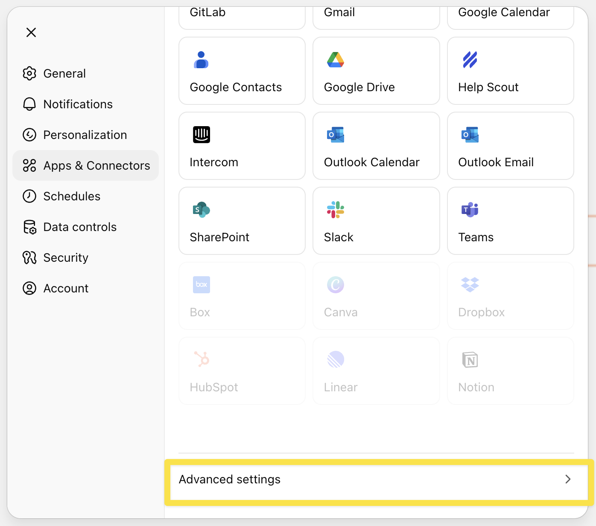
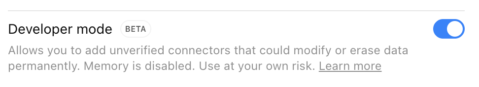
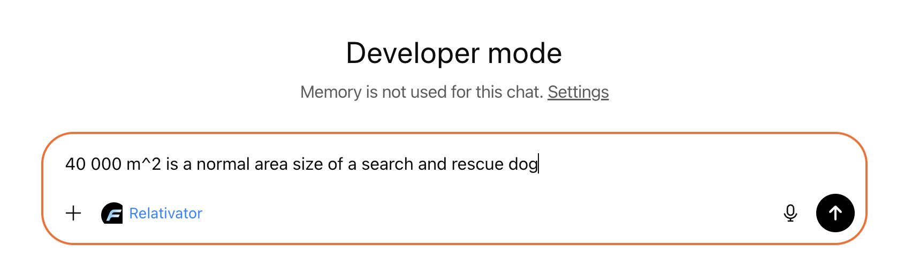
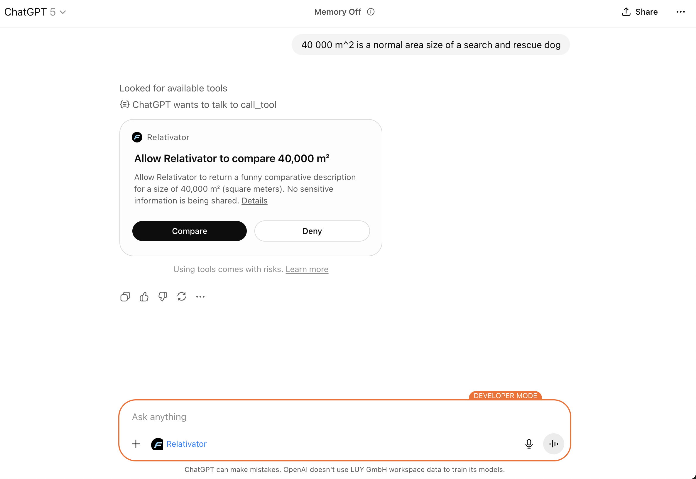

# ChatGPT

MCP servers are added as "connectors". ChatGPT has a marketplace where you can find and install connectors for various services.

Currently, own MCP servers can only be added in "Developer Mode" because it is in beta.
Developer mode can be enabled in the settings, but disables memory.

